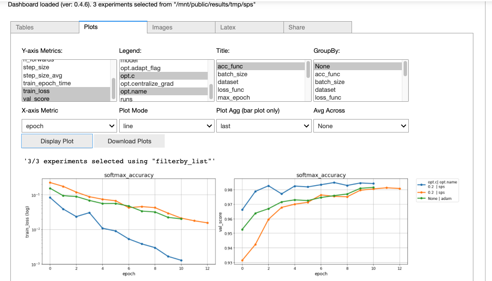

## SPS - Stochastic Polyak Step-size [[paper]](https://arxiv.org/pdf/2002.10542.pdf)
### Accepted at AISTATS 2021

Fast convergence with SPS optimizer. The first efficient stochastic variant of the classical Polyak step-size for SGD


### 1. Installation
`pip install git+https://github.com/IssamLaradji/sps.git`

### 2. Usage
Use `Sps` in your code by adding the following script.

```python
import sps
opt = sps.Sps(model.parameters())

for epoch in range(100):
    for X, y in loader:
        # create loss closure
        def closure():
          loss = torch.nn.MSELoss()(model(X), y)
          loss.backward()
          return loss

        # update parameters
        opt.zero_grad()
        opt.step(closure=closure)
```

### 3. Experiments

#### Training

```python
python trainval.py  -e  [Experiment group to run like 'mnist, cifar10, cifar100'] 
                    -sb [Directory where the experiments are saved]
                    -d  [Directory where the datasets are saved]
                    -r  [Flag for whether to save the experiments]
                    -j  [Scheduler for launching the experiments. 
                         Use None for running them on local maching]
                    -v  [File name where a jupyter is saved for visualization]
```

Example:

```
python trainval.py -e mnist -sb .results -d ../results -v results.ipynb -r 1
```

#### Visualizing

Open `results.ipynb` and run the first cell to get the following visualization of results.




#### Citation

```
@article{loizou2020stochastic,
  title={Stochastic polyak step-size for SGD: An adaptive learning rate for fast convergence},
  author={Loizou, Nicolas and Vaswani, Sharan and Laradji, Issam and Lacoste-Julien, Simon},
  journal={arXiv preprint arXiv:2002.10542},
  year={2020}
}
```

It is a collaborative work between labs at MILA, Element AI, and UBC.


#### Related Work 
Check out these other line search optimizers: [[sls]](https://github.com/IssamLaradji/sls), [[AdaSls]](https://github.com/IssamLaradji/ada_sls)

#### Credits

- Thank you [Less Wright](https://github.com/lessw2020) for incorporating the [gradient centralization method](https://arxiv.org/pdf/2004.01461.pdf), it seems to improve the results in some experiments.
